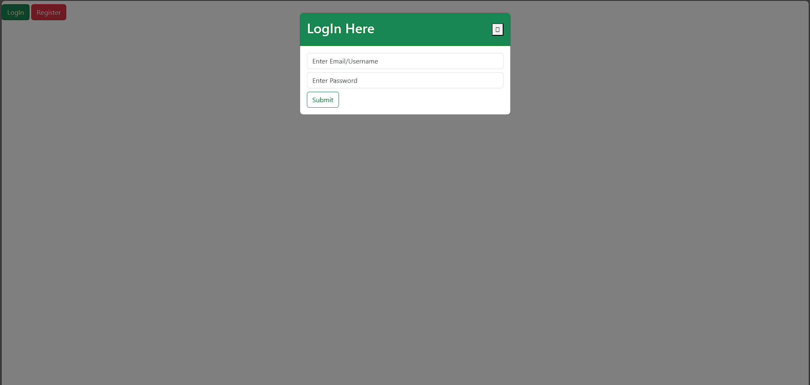

# Login Page

This is a modern and stylish login page created using HTML, CSS, JavaScript, Bootstrap, and Font Awesome. It provides an intuitive interface for users to input their credentials and log in to a system or application.

## Features

- Clean and attractive design with modern styling.
- Responsive layout that adjusts to different screen sizes.
- Form validation to ensure all required fields are filled before submission.
- Error handling to display relevant error messages to the user.
- Integration with Bootstrap for easy styling and layout components.
- Use of Font Awesome icons for enhanced visual appeal.

## Technologies Used

- **HTML**: Used for structuring the content of the page.
- **CSS**: Used for styling the elements and layout.
- **JavaScript**: Used for form validation and interactivity.
- **Bootstrap**: Frontend framework for responsive design and UI components.
- **Font Awesome**: Icon library for adding icons to the page.

## Screenshots



## Usage

1. Clone the repository:

    ```bash
    git clone https://github.com/swayam02072001/login-page.git
    ```

2. Open the `index.html` file in your web browser.

3. Enter your username and password.

4. Click on the "Login" button to submit the form.


## How to Customize

1. **Styling**: Modify the `style.css` file to change the appearance of the login page, including colors, fonts, and layout.

2. **Validation**: Update the `script.js` file to customize form validation rules or add additional functionality such as password strength validation or CAPTCHA.

3. **Bootstrap Components**: Use Bootstrap classes and components to customize the layout and styling of the login page further.

4. **Font Awesome Icons**: Replace or add Font Awesome icons in the `index.html` file to suit your design preferences.
---
